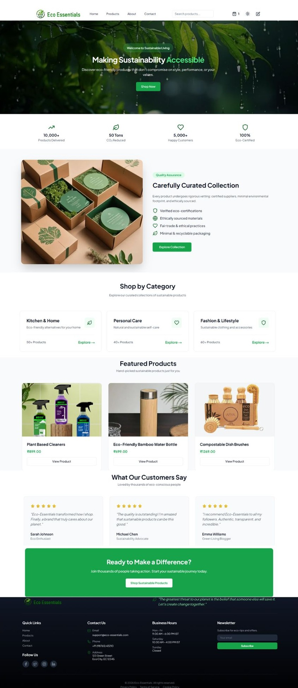
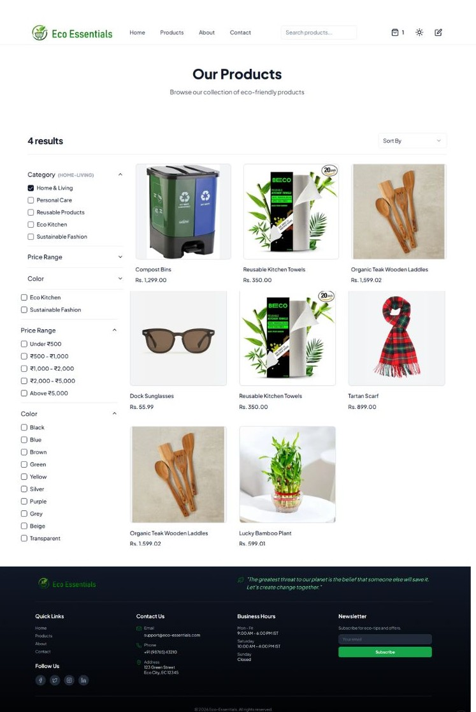
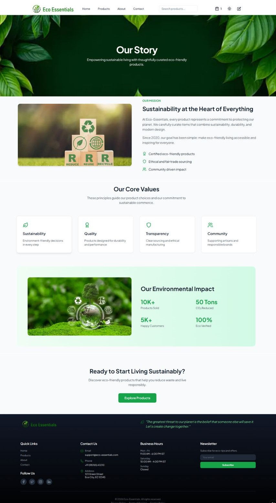
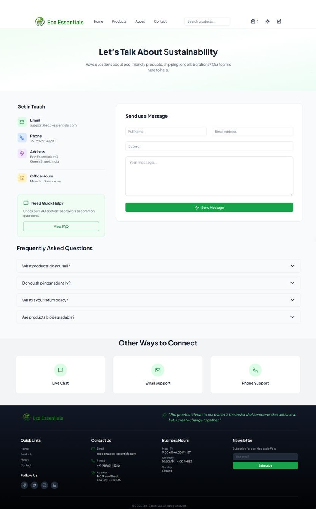
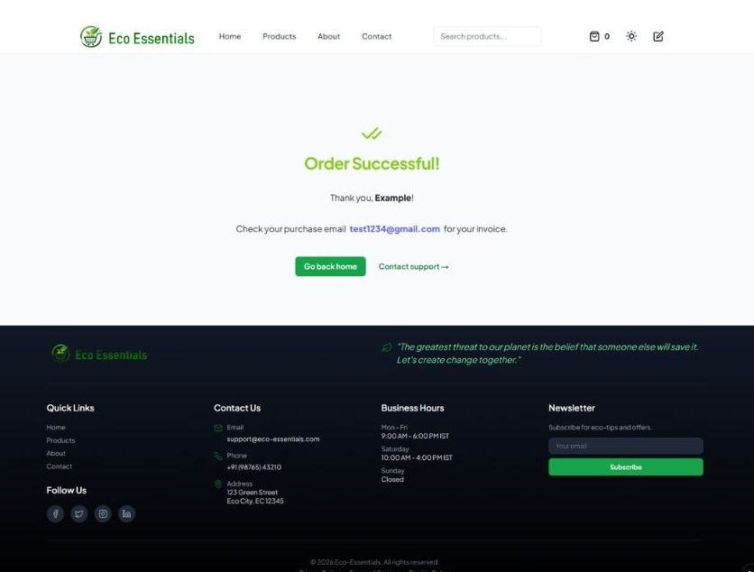

# 🌿 Eco-Essentials - An Eco-Friendly E-Commerce Platform

A modern e-commerce platform built with Next.js, featuring eco-friendly products, integrated shopping cart, secure Stripe payments, and Sanity CMS for content management.

## 📋 Table of Contents
- [Features](#features)
- [Tech Stack](#tech-stack)
- [Project Structure](#project-structure)
- [Installation](#installation)
- [Environment Variables](#environment-variables)
- [Running the Project](#running-the-project)
- [Deployment](#deployment)
- [Key Features Explained](#key-features-explained)
- [Troubleshooting](#troubleshooting)
- [Additional Resources](#additional-resources)

## ✨ Features

### User Features
- **Product Browsing**: View all available eco-friendly products with detailed information
- **Product Filtering**: Filter products by categories, colors, and more
- **Shopping Cart**: Add/remove items, manage quantities
- **Secure Checkout**: Complete order with Stripe payment integration
- **Order Success**: Confirmation page after successful payment

### Admin Features
- **Sanity Studio**: Manage products and content through integrated CMS
- **Product Management**: Create, update, delete products with image uploads
- **Content Editing**: Edit site content via Sanity Studio

### General Features
- **Responsive Design**: Optimized for all devices using Tailwind CSS
- **Contact Form**: Send messages via contact page
- **About Page**: Information about the business

## 🛠 Tech Stack

### Frontend
- **Next.js 16** - React framework for full-stack development
- **React 18** - UI library
- **Tailwind CSS** - Utility-first CSS framework
- **Lucide React** - Icon library
- **use-shopping-cart** - Shopping cart state management

### Backend
- **Next.js API Routes** - Serverless API endpoints
- **Sanity** - Headless CMS for content management
- **Stripe** - Payment processing
- **Sharp** - Image optimization

### Deployment
- **Vercel** - Hosting and deployment platform

---

## 📁 Project Structure

```
Eco-Essentials/
├── app/                    # Next.js app directory
│   ├── api/               # API routes
│   │   ├── checkout/      # Stripe checkout API
│   │   ├── checkout-success/ # Payment success handling
│   │   └── seed/          # Database seeding
│   ├── cart/              # Shopping cart page
│   ├── products/          # Products listing and details
│   ├── studio/            # Sanity Studio
│   ├── about/             # About page
│   ├── contact/           # Contact page
│   ├── success/           # Order success page
│   └── layout.tsx         # Root layout
├── components/            # Reusable UI components
│   ├── ui/               # Shadcn/ui components
│   ├── cart-items.tsx    # Cart item display
│   ├── product-grid.tsx  # Product grid
│   └── ...
├── config/                # Configuration files
├── lib/                   # Utility libraries
│   ├── sanity/           # Sanity client and utilities
│   ├── stripe.ts         # Stripe configuration
│   └── seed.ts           # Database seeding
├── sanity/                # Sanity CMS configuration
│   ├── schemas/          # Content schemas
│   └── lib/              # Sanity utilities
├── styles/                # Global styles
├── types/                 # TypeScript declarations
├── public/                # Static assets
└── README.md              # This file
```

---

## 🚀 Installation

### Prerequisites
- **Node.js** (v18+) and **npm**
- **Sanity Account** (for CMS)
- **Stripe Account** (for payments)
- **Git**

### Clone Repository
```bash
git clone https://github.com/maazfatima21/Eco-Essentials.git
cd Eco-Essentials
```

### Install Dependencies
```bash
npm install --legacy-peer-deps
```

---

## 🔐 Environment Variables

Create a `.env.local` file in the root directory and add the following variables:

| Variable | Description | Example |
|----------|-------------|---------|
| `NEXT_PUBLIC_SANITY_API_VERSION` | Sanity API version | `2023-05-12` |
| `NEXT_PUBLIC_SANITY_DATASET` | Sanity dataset name | `production` |
| `NEXT_PUBLIC_SANITY_PROJECT_ID` | Sanity project ID | `your_project_id` |
| `SANITY_API_TOKEN` | Sanity read/write token | `your_token` |
| `STRIPE_SECRET_KEY` | Stripe secret key | `sk_test_...` |

## ▶️ Running the Project

### Start Development Server
```bash
npm run dev
```
Application runs on: **http://localhost:3000**

### Build for Production
```bash
npm run build
npm run start
```

### Access Admin Studio
Navigate to `/studio` to manage products and content.

## 📸 Screenshots

### Home Page


### Products Page


### About Page


### Contact Page


### Cart & Payment Page


### Success Page



---

## 🎯 Key Features Explained

### Shopping Cart Management
- Uses `use-shopping-cart` library for state management
- Persistent cart data across sessions
- Real-time quantity updates

### Stripe Integration
- Secure payment processing with Stripe Checkout
- Redirects to Stripe hosted checkout page
- Webhook handling for payment success

### Sanity CMS
- Headless CMS for product management
- Integrated Studio for content editing
- Image optimization with Sanity's image API

### Responsive Design
- Mobile-first approach with Tailwind CSS
- Optimized for all screen sizes

---

## 🔧 Troubleshooting

### Build Errors
- Ensure all environment variables are set
- Run `npm install --legacy-peer-deps` to avoid peer dependency issues
- Check TypeScript errors with `npm run typecheck`

### Sanity Studio Issues
- Verify Sanity project ID and dataset
- Ensure API token has correct permissions
- Check network connectivity to Sanity CDN

### Stripe Payment Issues
- Confirm Stripe secret key is correct
- Test in Stripe test mode first
- Check webhook endpoints if using production

### Image Loading Problems
- Ensure images are uploaded to Sanity
- Check image URLs in product data
- Verify Sanity image API configuration

---

## 📚 Additional Resources

- [Next.js Documentation](https://nextjs.org/docs)
- [Sanity Documentation](https://sanity.io/docs)
- [Stripe Documentation](https://stripe.com/docs)
- [Tailwind CSS](https://tailwindcss.com/docs)
- [Vercel Deployment](https://vercel.com/docs)

---

**Last Updated**: March 13, 2026
**Live Demo**: https://eco-essentials-site.vercel.app

